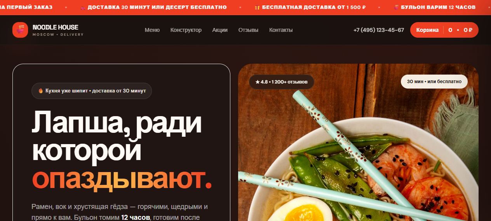

# Noodle House — доставка лапши

> Учебный веб-проект (pet-project) — демонстрация вёрстки и кода, **не коммерческий заказ**.

Сайт доставки рамена и вок: меню с карточками, корзина на localStorage, конструктор персонального бокса с живым пересчётом цены, промокоды, оформление заказа и модуль успеха.

## Демо
🔗 **[Открыть на GitHub Pages](https://Detroll1.github.io/noodle-house/)**



## Стек
HTML / CSS / vanilla JS · Tailwind CDN · корзина + конструктор

## Запуск локально
Статический сайт — просто открой `index.html` или подними локальный сервер:
```bash
python -m http.server 8124
# → http://127.0.0.1:8124
```

## Структура
Один входной `index.html`, стили и скрипты рядом. Данные и логика — в JS без завусеженности от бэкенда: сайт полностью работает из коробки.

---
© Detroll · noodle-house
